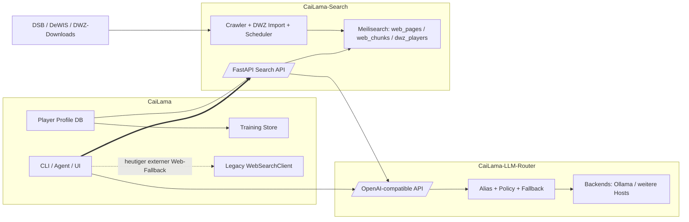
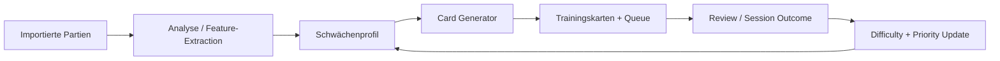
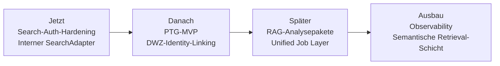

# Status und Ausbaupfade des CaiLama-Ökosystems

## Executive Summary

Das CaiLama-Ökosystem zeigt derzeit ein klares Muster aus **reifem Kernsystem plus zwei jungen, architekturpräzisen Satelliten-Repositories**. Das Hauptrepo **CaiLama** ist bereits ein modularer Schachtrainer mit belastbarer Runtime-, Rollen-, Trainings- und Player-Profile-Infrastruktur. **CaiLama-LLM-Router** ist dagegen ein sehr junges, aber schon erstaunlich konsistentes Gateway mit OpenAI-kompatibler API, Modell-Aliasen, Fallback-Policies und balanciertem Backend-Routing. **CaiLama-Search** ist die jüngste Codebasis; sie startet schon mit einer schlüssigen Zielarchitektur aus FastAPI-Zugriffsschicht, Meilisearch-Indizes, Trafilatura-Crawler und DWZ-Importpfad, ist aber funktional noch im Alpha-Stadium. fileciteturn60file0L3-L3 fileciteturn51file0L3-L3 fileciteturn53file0L3-L3 fileciteturn37file0L3-L3 fileciteturn41file0L3-L3 fileciteturn49file0L1-L3

Die beiden inhaltlich wichtigsten laufenden Arbeiten sind **Personalized Training Generator** in CaiLama und **Meilisearch-API-Key-Management** in CaiLama-Search. Beim Trainingsteil ist die Datengrundlage bereits erstaunlich weit: importierte Plattformpartien, Plattform-Accounts, externe Ratings, Unified-Rating-Profile, Session-Persistenz, Trainingskarten- und Review-Modelle sind vorhanden. Was noch fehlt, ist der durchgehende Generatorpfad, der aus dieser Datenbasis automatisiert **priorisierte, personalisierte Trainingskarten** erzeugt, bewertet und im Feedback-Zyklus verbessert. Beim Search-Teil ist das Gegenbild sichtbar: Der `MeiliKeyManager` existiert bereits mitsamt Unit-Tests, aber die Laufzeitpfade der API, CLI und des Schedulers verwenden weiterhin direkte Umgebungsvariablen und nicht den Key-Manager; zusätzlich sind die Admin-Endpunkte der API im sichtbaren Code nicht abgesichert und die Konfigurationsnamen sind inkonsistent. fileciteturn20file0L3-L3 fileciteturn22file0L3-L3 fileciteturn23file0L3-L3 fileciteturn24file0L3-L3 fileciteturn28file0L3-L3 fileciteturn29file0L3-L3 fileciteturn30file0L3-L3 fileciteturn40file0L3-L3 fileciteturn46file0L3-L3 fileciteturn39file0L3-L3 fileciteturn41file0L3-L3 fileciteturn44file0L3-L3

Architektonisch ist die größte Chance nicht „noch ein Modul“, sondern die **klare Orchestrierung der drei vorhandenen Bausteine**. CaiLama kennt bereits dedizierte Rollen wie `coach`, `analyst`, `critic`, `vision`, `scribe` und `researcher`, und sein LLM-Adapter unterstützt explizit OpenAI-kompatible Router. Gleichzeitig benutzt das Kernsystem für Websuche aktuell noch einen browserbasierten Google-Scraper mit Blockerkennung, während CaiLama-Search bereits `/v1/search`, `/v1/context` und DWZ-Endpunkte bereitstellt. Genau hier liegt der naheliegende Hebel: **internen Suchadapter vor externem Webscraping schalten**, Retrieval-Kontext gezielt den Router-Rollen zuführen und daraus den Personalized-Training-Generator speisen. fileciteturn60file0L3-L3 fileciteturn58file0L3-L3 fileciteturn37file0L3-L3 fileciteturn41file0L3-L3

Auch die offizielle DWZ-Landschaft unterstützt diese Richtung. Der Deutsche Schachbund beschreibt die DWZ-Datenbank als **DeWIS-basierte Onlinelösung**, deren ausgewertete Turniere innerhalb von 24 Stunden eingearbeitet werden; die Download-Seite nennt wöchentliche Exporte in der Nacht von Mittwoch auf Donnerstag und stellt seit dem 30. Juni 2024 reguläre CSV- und SQL-Downloads wie `LV-0-csv.zip` bereit. Die API-Seite dokumentiert öffentliche CSV-/Array-/teilweise XML-Zugriffe und weist zugleich darauf hin, dass Geschlecht und Geburtstag aus Datenschutzgründen entfernt werden. Die separate Registrierungsseite für die „neue Schnittstelle“ sagt allerdings auch, dass diese neue tokenisierte Schnittstelle deaktiviert wurde. Für CaiLama-Search ist der gegenwärtige Kurs – **Download-basierter Vollimport plus öffentliche Detail-/Cache-Endpunkte** – deshalb pragmatisch richtig. citeturn14view2turn14view3turn15view0turn16view1turn16view2turn16view3turn17view0turn17view2

Mein Gesamturteil lautet daher: **Das Ökosystem ist nicht konzeptionell überdehnt, sondern knapp vor der ersten echten Plattformstufe**. Die höchste Priorität hat jetzt nicht neues Scope-Wachstum, sondern **Integrationsdisziplin**: Search sicher machen und standardmäßig einbinden, PTG als vertikale End-to-End-Funktion fertigstellen, und Router-Search-Training als zusammenhängende Produktkette operationalisieren. Dann entsteht aus drei Repos kein loses Toolset mehr, sondern ein belastbares Schach-Trainingssystem mit kontrollierter Wissensbasis, rollenbasierter LLM-Steuerung und personalisiertem Lernloop. fileciteturn51file0L3-L3 fileciteturn53file0L3-L3 fileciteturn37file0L3-L3 fileciteturn20file0L3-L3

## Projektstatus der Repositories

Die drei Repositories stehen auf **unterschiedlichen Reifestufen**, aber ihre Zielbilder passen technisch bemerkenswert gut zusammen: CaiLama als orchestrierender Kern, LLM-Router als austauschbare Modellzugriffsschicht und CaiLama-Search als kontrollierter Retrieval-/DWZ-Dienst. Die folgende Übersicht konzentriert sich bewusst auf **belastbar sichtbare** Artefakte; Branch-/PR-/Issue-Metadaten sind dort, wo sie in den zitierbaren Artefakten nicht sicher ableitbar waren, als offen markiert. fileciteturn60file0L3-L3 fileciteturn51file0L3-L3 fileciteturn37file0L3-L3

| Repository | Aktueller Charakter | Jüngste belegbare Aktivität | Sichtbarer Branch-Stand | Beitragermuster | QA- und CI-Lage | Einschätzung |
|---|---|---|---|---|---|---|
| `TotoBa/CaiLama` | Reifer Produktkern mit Runtime-, Rollen-, Player-Profile- und Trainingslogik. fileciteturn60file0L3-L3 | Ein jüngerer Commit persistiert Rating-Aggregate, importierte Spiele und Training-Session-Historie; das ist direkt relevant für PTG. fileciteturn32file0L1-L3 | `main` ist als belegter Ref sichtbar; weitere aktive Branches sind aus den zitierbaren Artefakten nicht sicher ableitbar. fileciteturn60file0L3-L3 | Wirksam sichtbar ist ein owner-/kernteamzentrierter Entwicklungsstil; das Repo selbst ist als internes Kernsystem dokumentiert. fileciteturn11file0L3-L3 | Test-/Entwicklungsinfrastruktur ist im Projekt vorhanden, ein aktueller externer CI-Run war aus den belastbaren Artefakten nicht verifizierbar. fileciteturn19file0L3-L3 | **Stabile Basis**, aber mit noch offener Produktisierung der personalisierten Trainingspipeline. |
| `TotoBa/CaiLama-LLM-Router` | Junges, sauber geschnittenes Gateway mit OpenAI-kompatibler API, Aliasen, Policies und Fallback. fileciteturn51file0L3-L3 fileciteturn53file0L3-L3 | Initialer v0.1.0-Commit und kurz darauf „balanced backend routing“ mit Round-Robin, Cooldown und erweiterten Policies. fileciteturn57file0L1-L3 fileciteturn56file0L1-L3 | `main` ist als arbeitender Ref sichtbar. fileciteturn51file0L1-L3 | Aktuell stark owner-zentrierte Aufbauphase. fileciteturn57file0L1-L3 | `pytest`, `ruff`, `mypy` und strukturierte Tests sind im Projekt-Setup sichtbar; laufender CI-Status nicht belastbar verifiziert. fileciteturn52file0L3-L3 | **Architektonisch gut**, aber noch deutlich im frühen Produktisierungsfenster. |
| `TotoBa/CaiLama-Search` | Alpha-Dienst mit klarer Zielarchitektur: FastAPI + Meilisearch + DWZ + Crawler. fileciteturn37file0L3-L3 fileciteturn41file0L3-L3 fileciteturn62file0L3-L3 | Bisher ist vor allem ein umfangreicher `init`-Stand sichtbar, also ein strukturierter Erstaufschlag. fileciteturn49file0L1-L3 | `main` ist als arbeitender Ref sichtbar. fileciteturn37file0L1-L3 | Öffentlich erkennbar ist eher ein Initial-Authoring- bzw. Einzelentwicklungsmodus; Package-Autor ist „CaiLama Team“. fileciteturn38file0L3-L3 | Unit-Tests für Auth/API/Client/DWZ sind vorhanden; laufender CI-Status nicht belastbar verifiziert. fileciteturn38file0L3-L3 fileciteturn46file0L3-L3 | **Sehr gute Blaupause**, aber noch vor der Härtung für sicheren Betrieb und produktive Integration. |

CaiLama ist klar das **strategische Zentrum**. Die Runtime-Dokumentation zeigt, dass das System bereits Router-Rollen, lokale Konfiguration, Datenbank-/Player-Profile und Trainingsspeicher als zusammenhängende Laufzeit begreift. Gleichzeitig ist im Suchmodul noch der browserbasierte `WebSearchClient` für Google aktiv. Das heißt: Das System ist funktional schon breit, aber seine nächste Reifestufe hängt vor allem an der internen Such- und Trainingstiefe, nicht an zusätzlicher Modulfläche. fileciteturn60file0L3-L3 fileciteturn58file0L3-L3

CaiLama-LLM-Router ist in seiner jetzigen Form **kein Experiment mehr, sondern bereits eine brauchbare Infrastruktur-Schicht**. Die README und die Architektur-Doku ziehen die zentrale Linie sehr konsequent: Kimi-CLI und Schachsystem sollen nie direkt mit Ollama sprechen, sondern ausschließlich über den Router. Dass kurz nach dem Initial-Commit bereits `round_robin`, Cooldown und erweitertes Backend-State-Handling ergänzt wurden, spricht für aktive Betriebsorientierung statt nur Dokumentationsbau. fileciteturn51file0L3-L3 fileciteturn53file0L3-L3 fileciteturn56file0L1-L3

CaiLama-Search ist der **größte Chancenhebel**, aber auch das Repo mit der höchsten Härtungsnotwendigkeit. Das ist kein loses PoC-Skript, sondern bereits ein strukturiertes System mit Indizes `web_pages`, `web_chunks` und `dwz_players`, dedizierten Endpunkten für Suche, Kontext und DWZ sowie einem Scheduler für Import und Crawl. Gleichzeitig ist der aktuelle Entwicklungsstand noch „zu frisch“, um Sicherheit, Schlüsselmodell, Admin-Absicherung und Integrationspfade bereits als abgeschlossen zu betrachten. fileciteturn37file0L3-L3 fileciteturn41file0L3-L3 fileciteturn42file0L3-L3 fileciteturn63file0L3-L3

## Laufende Arbeiten und Blocker

### Personalized Training Generator in CaiLama

Die TODO-Datei formuliert die Stoßrichtung sehr eindeutig: Aus **importierten Plattformpartien** und **vereinheitlichten Spielerprofilen** soll ein „personalized training generator“ entstehen, der unter anderem persönliche Eröffnungen, Motive, Phasenschwächen, Kandidatenzugqualität und priorisierte Trainingsqueues ableitet. Damit ist das Zielbild nicht mehr abstrakt, sondern bereits produktnah beschrieben. fileciteturn20file0L3-L3

Gleichzeitig ist die Vorarbeit im Hauptrepo deutlich weiter, als die TODO allein vermuten lässt. Im Player-Profile-Bereich sind Plattform-Accounts, importierte Spiele, externe Ratings und `UnifiedRatingProfile`-basierte Aggregation bereits modelliert; der Workflow importiert Spiele, sammelt externe Ratings, erzeugt Aggregationen und persistiert das Ergebnis. Auf der Trainingsseite existieren persistente Karten-, Review-, Session- und Store-Modelle. Mit anderen Worten: **Datenbasis und Persistenz sind da; der Generator als verbindender Produktpfad ist das fehlende Stück.** fileciteturn29file0L3-L3 fileciteturn30file0L3-L3 fileciteturn22file0L3-L3 fileciteturn23file0L3-L3 fileciteturn24file0L3-L3 fileciteturn28file0L3-L3 fileciteturn26file0L3-L3

| Teilaspekt | Bestehende Evidenz | Betroffene Dateien | Konsequenz |
|---|---|---|---|
| Zielbild des PTG | TODO nennt personalisierte Karten, Motive, Phasenfehler, Kandidatenzugqualität und Queue-Priorisierung. fileciteturn20file0L3-L3 | `TODO.md` | Ziel ist fachlich präzise genug, um ein MVP zu schneiden. |
| Datenaufnahme | Plattform-Accounts, importierte Spiele und externe Ratings sind modelliert; Persistenz ist vorhanden. fileciteturn29file0L3-L3 fileciteturn30file0L3-L3 | `player_profile/models.py`, `player_profile/store.py` | Datenmodell ist **kein** Hauptblocker mehr. |
| Vereinheitlichte Bewertung | `RatingAggregator` bildet ein `UnifiedRatingProfile` aus Plattformdaten und externen Ratings. fileciteturn22file0L3-L3 | `player_profile/rating_aggregator.py` | Personalisierung kann auf stabilem Profil statt Einzelwerten aufsetzen. |
| Workflow-Persistenz | Workflow importiert Spiele/Ratings und referenziert importierte Spiel-IDs im Session-Zustand. fileciteturn23file0L3-L3 fileciteturn24file0L3-L3 | `player_profile/workflow.py` | Die **Brücke zu Training** ist technisch schon vorbereitet. |
| Trainingsobjekte | Persistente Trainingskarten, Review-Runden und Sessions sind definiert; ein JSON-Store existiert. fileciteturn28file0L3-L3 fileciteturn26file0L3-L3 | `training/models.py`, `training/card_store.py` | Das Ausgabemodell des PTG ist vorhanden. |
| Fehlender Generatorpfad | Im sichtbaren Trainings-README ist Trainingsinfrastruktur dokumentiert, aber kein fertiger End-to-End-Generator beschrieben; die TODO markiert das Thema weiter als offene Arbeit. fileciteturn25file0L3-L3 fileciteturn20file0L3-L3 | `training/README.md`, `TODO.md` | Hauptlücke ist **Orchestrierung und Heuristik**, nicht Speicherung. |

Die wahrscheinlichsten Blocker sind daher nicht „fehlende Daten“, sondern **fehlende fachliche Verdichtung**. Erstens braucht der PTG eine robuste Fehler- und Mustertaxonomie: Eröffnungsabweichung, Taktikmotiv, Technikfehler, Zeitmanagement-/Phasenproblem, Kandidatenzugqualität, Endspiellücke. Zweitens fehlt sichtbar die Priorisierungslogik, die aus dieser Taxonomie konkrete Trainingskarten mit Schwierigkeitsgrad, Wiederholungsintervall und Nutzenabschätzung erzeugt. Drittens ist noch kein geschlossener Feedback-Kreis erkennbar, der Review-Resultate wieder in die Profil- und Queue-Gewichtung zurückschreibt. Genau diese drei Punkte entscheiden darüber, ob PTG nur „automatisch erzeugte Karten“ oder wirklich **personalisiertes Training** liefert. fileciteturn20file0L3-L3 fileciteturn28file0L3-L3 fileciteturn23file0L3-L3

### Meilisearch-API-Key-Management in CaiLama-Search

Im Search-Repo ist das Key-Management **konzeptionell bereits angelegt**. `auth.py` definiert einen `MeiliKeyManager`, der Keys auflisten, anlegen, löschen und rotieren kann und explizit ein Search-Key-/Admin-Key-Muster für CaiLama vorsieht. Die Tests decken genau diese Semantik ab: Master-Key-Pflicht, Create/List/Rotate und die Wiederverwendung bestehender Search-Keys. fileciteturn40file0L3-L3 fileciteturn46file0L3-L3

Das eigentliche Problem ist die **fehlende Laufzeitverdrahtung**. Die FastAPI-App, der Client, die Scheduler-Schicht und die CLI greifen direkt auf `MEILI_HOST` und `MEILI_API_KEY` zu, initialisieren den `MeiliClient` unmittelbar und importieren den Key-Manager nicht in den produktiven Codepfad. Parallel dazu definiert `config.py` aber ein anderes Namensschema mit `CAILAMA_MEILI_API_KEY` und `CAILAMA_MEILI_MASTER_KEY`; die `.env.example` wiederum kennt `MEILI_HOST` und `MEILI_MASTER_KEY`, aber nicht die `CAILAMA_*`-Varianten. Das ist kein theoretischer Schönheitsfehler, sondern eine reale Integrationsbremse. fileciteturn41file0L3-L3 fileciteturn42file0L3-L3 fileciteturn63file0L3-L3 fileciteturn44file0L3-L3 fileciteturn39file0L3-L3 fileciteturn43file0L3-L3

| Teilaspekt | Bestehende Evidenz | Betroffene Dateien | Konsequenz |
|---|---|---|---|
| Dediziertes Schlüsselmodell | Search-Key und Admin-Key sind als getrennte Convenience-Pfade modelliert. fileciteturn40file0L3-L3 | `search_backend/auth.py` | Sicherheitsmodell ist fachlich schon gedacht. |
| Testdeckung | Unit-Tests decken Key-Anlage, Wiederverwendung und Rotation ab. fileciteturn46file0L3-L3 | `tests/test_auth.py` | Das Modul ist nicht bloß Skizze. |
| Runtime-Nutzung | API, Client und Scheduler nutzen direkte `MEILI_*`-Variablen; kein sichtbarer produktiver Key-Manager-Aufruf. fileciteturn41file0L3-L3 fileciteturn42file0L3-L3 fileciteturn63file0L3-L3 | `api.py`, `client.py`, `scheduler.py` | Der Key-Manager ist **noch kein Betriebsbestandteil**. |
| Konfigurationskonsistenz | `config.py` nutzt `CAILAMA_*`, `.env.example` und CLI aber `MEILI_*` bzw. `API_PORT`. fileciteturn39file0L3-L3 fileciteturn43file0L3-L3 fileciteturn44file0L3-L3 | `config.py`, `.env.example`, `__main__.py` | Hohes Risiko von Fehlkonfiguration und Shadow-Settings. |
| Admin-Härtung | Die API deklariert `/v1/admin/...`-Endpunkte; im sichtbaren Modul ist kein Request-Auth-Mechanismus erkennbar. fileciteturn41file0L3-L3 | `api.py` | Vor produktiver Exponierung **muss** API-Auth ergänzt werden. |

Ein zusätzlicher, externer Realitätscheck kommt vom DSB selbst: Die öffentliche DWZ-Welt ist nutzbar, aber der DSB weist zugleich darauf hin, dass die „neue Schnittstelle“ mit Token/Registrierung deaktiviert wurde. Für CaiLama-Search folgt daraus: Die Suchplattform sollte **nicht** auf eine vermeintlich stabile, registrierte DWZ-Token-API planen, sondern den aktuellen Kurs beibehalten: öffentliche Downloads, öffentliche Cache-/Spielerdaten und interne Indizierung. citeturn15view0turn17view0turn17view2

## Architektur, Schnittstellen und Datenflüsse

Die Architektur ist bereits heute fast vollständig als **Dreiklang** lesbar: CaiLama verwaltet Benutzerinteraktion, Trainingslogik, Profile und Produktfluss; der LLM-Router kapselt Modellwahl und Ausfallstrategien; CaiLama-Search kapselt Retrieval, DWZ-Anbindung und künftig kuratierte Wissensquellen. Das große Potenzial liegt darin, dass diese Trennung nicht künstlich wirkt, sondern sehr gut auf die vorhandenen Interfaces passt. fileciteturn60file0L3-L3 fileciteturn53file0L3-L3 fileciteturn37file0L3-L3



Im LLM-Pfad ist die Kopplung bereits sauber. CaiLama dokumentiert explizit OpenAI-kompatible Router-Anbindung und rollenbasierte Alias-Namen wie `chess-small`, `chess-large`, `chess-task`, `chess-coach`, `chess-analyst` und `chess-researcher`. Der Router setzt genau darauf auf: Er stellt `/v1/chat/completions`, `/v1/models` und `/health` bereit, löst Modell-Aliase auf Backends/Provider-Modelle auf und behandelt Rate-Limits, Connection Errors und Cooldowns über Policies. Das ist eine **gute contract-first-Grenze** zwischen Produkt und Modellinfra. fileciteturn60file0L3-L3 fileciteturn51file0L3-L3 fileciteturn53file0L3-L3 fileciteturn56file0L1-L3

Im Retrieval-Pfad ist die Kopplung noch nicht ausgereift, aber die Soll-Form liegt offen auf dem Tisch. CaiLama benutzt derzeit noch `WebSearchClient`, der Google per Browserautomatisierung aufruft, Blockerkennung per CAPTCHA-/„unusual traffic“-Heuristik enthält und Seiteninhalte durch Rendern/Extraktion einsammelt. CaiLama-Search bietet dagegen schon die intern kontrollierbaren Endpunkte `/v1/search`, `/v1/context`, `/v1/dwz/search`, `/v1/dwz/player/{pkz}` und `/v1/doc/{id}`. Technisch ist der logisch nächste Schritt daher: **`SearchApiClient` als Standard, browserbasierte Live-Websuche nur noch als expliziter Fallback**. fileciteturn58file0L3-L3 fileciteturn37file0L3-L3 fileciteturn41file0L3-L3

Auch der Datenfluss zu DWZ ist architektonisch sinnvoll. CaiLama-Search hält DWZ getrennt in `dwz_players`, was sauber zur DSB-Struktur passt: Die offizielle DWZ-Datenbank läuft über DeWIS, wird laut DSB innerhalb von 24 Stunden nach Auswertung aktualisiert, bietet öffentliche Cache-/API-seitige Spieler-/Vereins-/Verbandszugriffe und zusätzlich wöchentliche Voll-Downloads wie `LV-0-csv.zip`. Der Scheduler im Search-Repo plant dementsprechend einen DWZ-Vollimport und einen separaten Source-Crawl; das passt gut zu einem Muster aus **stabilem Bulk-Import plus gezieltem Refresh**. fileciteturn42file0L3-L3 fileciteturn63file0L3-L3 citeturn14view2turn14view3turn15view0turn16view1turn16view3

Die interne Trainingsarchitektur von CaiLama ist für diese Anbindung bereits vorbereitet. Der Workflow-Pfad speichert importierte Spiele, externe Ratings und Profile, während die Trainingsseite persistente Karten, Sessions und Reviews kennt. Deshalb wäre es technisch sauber, den Personalized Training Generator **nicht** als viertes externes Repo zu bauen, sondern als vertikale Schicht im Hauptrepo: ingestierte Spiele → Analyse/Fehlertaxonomie → Karten/Queue → Review-Feedback. Search und Router würden diesen Pfad nur anreichern, nicht dominieren. fileciteturn23file0L3-L3 fileciteturn24file0L3-L3 fileciteturn28file0L3-L3 fileciteturn26file0L3-L3

## Feature- und Integrationsvorschläge

Die folgenden Vorschläge priorisieren nicht „möglichst viele Features“, sondern **maximalen Plattformgewinn pro zusätzlicher Komplexität**. Entscheidend ist, dass jedes Feature an bereits vorhandene Module andockt und nicht wieder eine Parallelarchitektur erzeugt. fileciteturn60file0L3-L3 fileciteturn51file0L3-L3 fileciteturn37file0L3-L3

| Vorschlag | Beschreibung | Nutzen | Aufwand | Abhängigkeiten | Sicherheits- / Datenschutzrisiko | Impact | Priorität |
|---|---|---|---|---|---|---|---|
| **Interner SearchAdapter in CaiLama** | Neuer `SearchApiClient`, der standardmäßig `/v1/search`, `/v1/context` und `/v1/dwz/*` nutzt; browserbasierte Google-Suche nur noch Fallback. | Reproduzierbarkeit, weniger Bot-/CAPTCHA-Risiko, kontrollierter Korpus. | M | Bestehender `WebSearchClient` im Kern; Search-API-Endpunkte bereits vorhanden. fileciteturn58file0L3-L3 fileciteturn41file0L3-L3 | Niedrig bis mittel; wichtig ist interne API-Absicherung. | Hoch | **Sehr hoch** |
| **PTG-MVP** | End-to-End-Pfad: importierte Partien → Engine-/Heuristik-Analyse → Schwächenprofil → Karten + Queue. | Höchster direkter Produktwert für Nutzer. | L | Player-Profile, Rating-Aggregation, Session-/Card-Modelle sind da. fileciteturn22file0L3-L3 fileciteturn23file0L3-L3 fileciteturn28file0L3-L3 | Mittel; personenbezogene Leistungsprofile brauchen Retention- und Exportkonzept. | Sehr hoch | **Sehr hoch** |
| **Search-Auth-Hardening** | Meili-Key-Bootstrap, konsistente Env-Namen, getrennte Service-Keys, Schutz der Admin-Endpunkte per Token/mTLS/Reverse Proxy. | Produktionsreife und sichere Exponierung. | M | `auth.py`, `config.py`, `api.py`, CLI/Scheduler. fileciteturn40file0L3-L3 fileciteturn39file0L3-L3 fileciteturn41file0L3-L3 fileciteturn44file0L3-L3 | Hoch, solange ungehärtet. | Sehr hoch | **Sehr hoch** |
| **DWZ-Identity-Linking** | Matching von Plattformkonten/Profilen auf DWZ-Spieler, inkl. Club-/Verband-/Rating-Kontext. | Bessere Personalisierung, Turnier- und Vereinskontext, robustere Profile. | M | `platform_accounts`, externe Ratings, `/v1/dwz/search`, `/v1/dwz/player/{pkz}`. fileciteturn29file0L3-L3 fileciteturn41file0L3-L3 | Mittel; Matching-Fehler und PII-Minimierung beachten. | Hoch | Hoch |
| **RAG-gestützte Analysepakete** | `researcher`-/`analyst`-Rollen mit `/v1/context` füttern, z. B. Eröffnungsdossiers, Gegnerprofile, evidenzbasierte Berichte. | Sichtbarer Synergiegewinn zwischen Router und Search. | M | Rollenmodell in CaiLama und Router; Search-Kontext-Endpunkt vorhanden. fileciteturn60file0L3-L3 fileciteturn41file0L3-L3 | Mittel; Quellenprovenienz und Prompt-Disziplin wichtig. | Hoch | Hoch |
| **Einheitliche Job-Orchestrierung** | Import, Crawl, Game-Analyse, PTG und Reindex als gemeinsame Queue-/Jobstruktur. | Weniger fragile Ad-hoc-Läufe, bessere Betriebsstabilität. | M bis L | CaiLama-Queue/Training, Search-Scheduler. fileciteturn60file0L3-L3 fileciteturn63file0L3-L3 | Niedrig | Mittel bis hoch | Mittel |
| **Auswertungs- und Observability-Layer** | JSONL-/KPIs für Router, Suchgoldsets, PTG-Erfolgsmetriken, Privacy-safe Dashboards. | Frühwarnsystem gegen Qualitätsregression. | M | Router-Logging, Search-Metriken, Session-/Review-Protokolle. fileciteturn51file0L3-L3 fileciteturn28file0L3-L3 | Niedrig bis mittel; Log-Inhalte strikt minimieren. | Hoch | Hoch |
| **Optionale semantische Retrieval-Schicht** | Zusätzlicher Embedding-/Reranking-Layer über dem bestehenden Meili-Lexikalindex. | Bessere Recall-Qualität bei semantischen Queries. | L bis XL | Zusätzlicher Embedding-Dienst und Eval-Datensatz; Hybrid Retrieval ist allgemein ein gängiges Muster für semantische + metadatengefilterte Suche. citeturn20view0 | Mittel | Mittel | Mittel |

### Technische Designskizze für den internen SearchAdapter

Der SearchAdapter sollte als **schlanke Anti-Corruption-Layer** im Hauptrepo leben. Er übersetzt Suchanfragen aus Agent-/CLI-Kontext in Search-API-Calls, vereinheitlicht Rückgabeformate und entscheidet, wann auf den bisherigen browserbasierten Web-Client zurückgefallen wird. So bleibt CaiLama produktseitig stabil, während Search iterieren darf. Die Endpunkte dafür sind bereits vorhanden. fileciteturn58file0L3-L3 fileciteturn41file0L3-L3

**Empfohlene Komponenten**

- `src/cailama/search_api/client.py`
- `src/cailama/search_api/models.py`
- `src/cailama/search_api/adapter.py`
- `config/default.toml` um `[search_api]`
- Fallback-Strategie: `internal_first`, `external_fallback`, `external_only`

**Vertragsskizze**

```text
CaiLama Query
  -> SearchAdapter.search(query, mode="context|web|dwz")
      -> CaiLama-Search /v1/context
      -> CaiLama-Search /v1/search
      -> CaiLama-Search /v1/dwz/search
  -> normalize result bundle
  -> optional fallback to WebSearchClient
```

### Technische Designskizze für den Personalized Training Generator

Der PTG sollte als **deterministische Pipeline mit nachvollziehbarem Scoring** starten, nicht als rein promptgesteuertes LLM-Feature. LLMs können später beim Erklären, Clustern oder Umformulieren helfen; die eigentliche Auswahl- und Priorisierungslogik sollte aber aus importierten Spielen, Ratings, Engine-/Heuristiksignalen und Review-Historie ableitbar sein. Die vorhandene Persistenzschicht ist dafür ausreichend. fileciteturn22file0L3-L3 fileciteturn23file0L3-L3 fileciteturn28file0L3-L3



**MVP-Schnitt des PTG**

- Eröffnungs-Drift aus frühen Zügen
- Phasenklassifikation: Eröffnung / Mittelspiel / Endspiel
- Fehlerklassen: Taktik, Technik, Plan, Conversion, Verteidigung
- Kartentypen: „Erkenne Motiv“, „Finde Kandidatenzug“, „Spiele Technik“, „Rekapituliere Plan“
- Priorisierung = Fehlerhäufigkeit × Schwere × Aktualität × Rating-Kontext × Review-Verlauf

### Technische Designskizze für Search-Auth und Schlüsselbetrieb

Das Search-Repo braucht keine komplizierte IAM-Plattform, sondern **eine kleine, konsistente Betriebsdisziplin**:

- genau **ein** Environment-Namensschema
- Bootstrap per Master-Key nur im Admin-Setup
- danach getrennte Runtime-Keys für Search und Admin
- Admin-Endpunkte nur intern oder hinter Reverse Proxy + Service-Auth
- Key-Rotation als expliziter CLI-/Ops-Befehl
- keine direkten Master-Keys in App-Runtime außerhalb des Bootstrap-Pfads

Das ist besonders wichtig, weil der Code bereits Admin-Endpunkte für Reindex/Crawl/DWZ-Reimport anbietet und weil der DSB selbst auf Datenschutzminimierung in der API hinweist. fileciteturn40file0L3-L3 fileciteturn41file0L3-L3 citeturn15view0

## Priorisierung und Roadmap

Die sinnvollste Sequenz ist **erst entkoppeln und härten, dann personalisieren und anreichern**. Search-Auth-Hardening und interner SearchAdapter sind die besten Quick Wins, weil sie auf bereits vorhandene Artefakte aufsetzen und zugleich den größten Plattformgewinn bringen: weniger externer Web-Scraping-Schmerz, sauberere Retrieval-Verträge und deutlich bessere Betriebsfähigkeit des Search-Backends. Der aktuelle Google-Scraper ist funktionsfähig, aber inhärent fragiler als eine eigene Search-API; gleichzeitig ist das Search-Repo nahe genug an einem internen Dienst, um jetzt schon als Standardquelle zu dienen. fileciteturn58file0L3-L3 fileciteturn41file0L3-L3

Danach sollte der PTG als **erstes vertikales End-to-End-Produktfeature** folgen. Das ist wichtig, weil dadurch die bereits investierte Player-Profile- und Trainingspersistenz endlich in extern sichtbaren Nutzwert übersetzt wird. DWZ-Linking sollte unmittelbar daneben laufen, weil es Profil- und Schwächenmodelle stärker verankert, aber nicht aufwändiger sein muss als ein robustes Identitäts-Matching mit manueller Bestätigung bei Ambiguitäten. fileciteturn20file0L3-L3 fileciteturn29file0L3-L3 fileciteturn30file0L3-L3 fileciteturn28file0L3-L3

Erst in der dritten Welle würde ich auf breitere Plattformfeatures wie semantische Retrieval-Erweiterungen, umfassende Job-Orchestrierung und tiefere Observability gehen. Diese Themen sind wertvoll, aber ihr Nutzen ist am größten, wenn SearchAdapter, PTG-MVP und Search-Auth bereits stabil sind; sonst baut man Metriken und Zusatzkomplexität auf eine noch nicht festgezogene Produktkette. fileciteturn63file0L3-L3 fileciteturn51file0L3-L3



## Offene Fragen und Grenzen

Einige Statuspunkte bleiben trotz der vorliegenden Evidenz bewusst als **nicht belastbar verifiziert** markiert. Dazu gehören vor allem **aktuell offene PRs/Issues**, die vollständige Landschaft aktiver Branches jenseits des sichtbar verwendeten `main`-Refs und der **laufende CI-Status** auf GitHub. Für die beiden öffentlichen Neben-Repos war der Codezustand gut einsehbar, aber nicht jede GitHub-Metadatenoberfläche war in zitierbarer Form abrufbar.

Beim Hauptrepo **CaiLama** kommt hinzu, dass es sich um ein nicht öffentlich sichtbares Kernrepo handelt. Die hier getroffenen Aussagen zu Architektur, laufender Arbeit und Reifegrad sind deshalb **hochwertig innerhalb des Connector-Zugriffs**, aber nicht extern reproduzierbar wie bei einem vollständig öffentlichen Repository.

Schließlich waren keine Deployment-, Last- oder Nutzergrößenbeschränkungen spezifiziert. Ich habe daher konsequent mit der Arbeitsannahme **„keine spezifischen Constraints“** bewertet. Für produktive Priorisierung im engeren Sinn wäre als nächster Schritt vor allem interessant, ob ihr eher auf **Einzelnutzer-/Power-User-Betrieb**, **kleines Team-Deployment** oder **öffentliche Mehrnutzer-Exponierung** zielt, weil sich daraus Sicherheits- und Betriebsprioritäten weiter zuspitzen würden.
